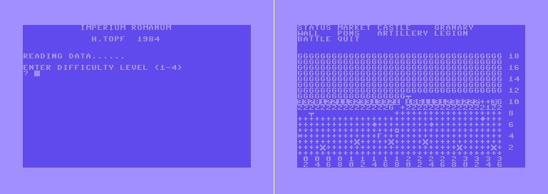

ROMAN EMPIRE
============

Your task in this game, tested on the Commodore 64 and the Pet 3032/4032, is to lead the German province of Germania Magna, south of the river Elba, and hold it for nine years.

Once the program is running, select the difficulty level on a scale of one to four by entering a single digit. You are then offered the chance to load the data referring to a previously saved game.

A map is then displayed on the screen. The co-ordinates occupied by your troops are represented by the plus sign, and the German zone is distinguished by the letter G. The spaces represent the river.

The game begins with the German economic phase (building, and assembling troops) and progresses to the German military phase when artillery and troops will actually be used.

Your chance to respond starts with the Roman economic phase. The situation can be affected in the following ways:
- S (status) Shows your state revenues
- M (market) Builds a market in your province. It costs 1599 silver pieces and earns 80 per cent each turn. You can build it on any +
- C (castle) Building a castle costs 6000 silver pieces and earns 30 per cent each turn. Put it on any + which is completely surrounded by similar squares
- W (wall) A defensive unit which costs 250 silver pieces. It can be added to the north-west edge of a building and be extended to the east or west
- G (granary) Costs 600 silver pieces and earns 50 per cent each turn. It can only stand on the south-west edge of a castle or another granary (you need one for each castle and market)
- P (pontoon) Forms a bridge to enable you to cross the river. It costs 500 pieces to build and 25 to maintain for each turn. Can be placed in any space square (the river)
- A (artillery) This costs 900 pieces. To create a unit you must enter the location of any castle with + square on its eastern side
- L (legion) Costs 900 pieces and requires the entry of a castle with a + to the north. Each cohort (one ninth of a legion) costs 100 pieces each turn
- Q (quit) This stops the game and gives you the chance to save it on tape or disk. You can then leave the game or continue
- B (battle) This should be used only when all construction commands have been completeted or when you are satisfied with state revenues. The game now continues with battle phase

Roman Battle Phase
------------------

There are two main routines to this part of the program. First the program checks to see if you have any guns, and if this is the case it gives you the opportunity to fire into the hostile territory. 
First enter the co-ordinates of any of your guns (F on the screen) and those of the target you have selected. The program will tell you where your shot has landed, but this will not necessarily be where you aimed! 
You will be given the chance to fire as many guns as you posses, but entering 0,0 as the co-ordinates will enable you to leave this sequence early.

Your troop movement take up the next routine. You can move guns or cohorts (represented by numbers of the grid) one square in any direction, and you may also cross any bridgees which are not held by the enemy. 
If you take over the enemy's buildings they will provide you with revenue for the next turn.

If you decide to enter hostile territory you may choose to send a spotter or a whole cohort. Whenever your troops come into contact with enemy forces battle will results. 
The winner (not always the force with numerical superiority) takes over the disputed square and the loser retreats or is wiped out.

The routine can be left by entering 1,1 or by using up all your moves.

Victory Conditions
------------------

After the battle phase the state of the two sides is calculated. If the one side's losses are more than 20 per cent of the troop strength then the game is ended.
Another premature ending can be caused by starvation or the bankruptcy of one side. After nine years (one year consisting of four seasons) the game ends automatically and the performances of the two sides are judged.

Useful Tips
-----------

Symbols:
- heart = clear screen
- S = cursor home
- Q = cursor down
- bracket = cursor right
- R, _ = reverse, off

Variables:
- Y$ (Y) sets cursor in front of line Y in the map. So the map is served without printing the whole screen.
- SE decides about 'spiel ende' = end of game
- A$ (I) sets cursor home and moves it 5×I spaces to the right. It's used for the tables.
- AI$,AN,AN$ (1-4),AV are used for current year (ANNO) and season, when the next turn is started.
- RT, PT — treasure (R for roman, P for enemy)
- RM, PM — number of soldiers (milites)
- RO, PO — number of markets
- RC, PC — number of castles
- RH, PH — number of granaries (horreum)
- RF, PF — number of guns (funda)
- RV, PV — number of walls (vallum)
- RP — number of bridges (pons)
- RL, PL — number of losses
- CL — costs per one legion = 9 troop units
- CO,CC,CH,CV,CF,CP — costs for buildings
- CR,CE — number of captured officers after one battle
- M(X,Y) — this is the most important variable. It constructs the map of 36x18 matrix-elements. It's value decides about enemies (-) or Roman (+) buildings.
    - Values of M: 0 water, 1 land, 1.1 market, 1.2 castle, 1.3 granary, 1.4 wall, 1.5 crater, 1.6 bridge, 1.7 gun, greater than 2.0: Roman troops, less than -2.0: enemy
- X,XI ...,A,AI  ... are variables for x-axis.

Explanation of the Code Lines
-----------------------------

- 1-20: Initialize variables
- 21-35: Initialize the map. Should line 27 set the number of bridges to 2 instead of letting it be 0? Actually, it could be only 1 as the bridge might be positioned at M(0,8), which is outside of the visible map
- 36-40: Place German troops on row 10 and Roman legions on row 9. Entered difficulty level DI tells how much to increase the column value (1-35) between each step in the troop placements loop.
Should the increase in the number German soldiers be moved before the if-condition for the Roman land so that the increase would happen irrespectively of the Roman troop increase?
- 41: Use a saved game?
- 42: Should the code jump to the line 84 instead of 85 to also update the Roman treasury?
- 43-57: Print status. Should the "Roman" and "German" string variables R$ and E$ be initialized only once?
- 58: Ask user to "PRESS RETURN"
- 59-61: Clear the first five lines on the screen
- 62-63: Build a market
- 64-66: Build a castle. It can be located on any Roman land that has Roman land both to the south and to the east side
- 67-70: Build a granary
- 71-74: Build a wall
- 75-76: Build a bridge
- 77-78: Build an artillery
- 79-82: Assemble troops
- 83: Did either side lose the game?
- 84-85: Update treasuries
- 87-98: Main menu
- 99: Check for victory conditions, build streets and start the Roman turn
- 100: Germans build a castle?
- 101: Germans build a market?
- 102: Germans build a granary or a wall?
- 103: Germans build an artillery?
- 104: Germans hire troops if they have fewer number of troops than the Romans or they have at least two more castles than the Romans. The hiring process will happen at most three times the number of the castles. That limit doesn't apply in the spring time
- 105: Germans build a castle
- 106: Germans build a market
- 107: Germans build a granary
- 108: Germans build a wall
- 109: Germans build an artillery
- 110: Germans hire 5 units for the cost of 500 pieces if they have more than 1000 pieces left in the treasury
- 111-112: Germans hire more troops?
- 113: Germans enters the battle phase
- 114-118: Place the German troops on a random column in a row loop (3-15). The process repeats until a German land is found to place the unit
- 119: Increase the time
- 120: Romans use artillery?
- 121-162: Romans move the troops or artillery. If an artillery is moved to a wall the unit is "TRAPPED" and the wall is destroyed. If a legion is moved to a wall then a third of the troops are killed. You can't stack "MORE THAN 2 LEGIONS". A move to a Roman land (line 133) and crossing a bridge (line 137) counts as a move (RR), which are limited by the number of streets build that turn +1 (line 148). There is a second limitation to the number of moves (SM) on line 121 where SM>5+RM/50 ends the troop movement phase. Essentially, at least five moves are allowed and the rest depends on the number of the number of soldiers (RM). Spring time reduces the number of available moves via SM to half (line 122)
- 163-185: Roman artillery. If the Euclidean distance from the gun location to the target is smaller than 6+5*RND(1), i.e. [6,11], the first aberration step in the gun's accuracy algorithm is skipped ([-3,0] in the y-direction). The other random aberrations step is uniformly random [-2,2]x[-2,2]
- 186-219: German loops over rows 2-17 selecting a random column on each row looking for German troops to move. The loop repeats until troops are found. The target search is performed column first from the upper-left corner. The last found target is used. Non-land and non-crater Roman targets are preferred. DOES LINE 217 MOVE TROOPS TO THE BRIDGE AND CHANGE GERMAN TROOPS INTO ROMANS?
- 220-221: Has a German unit reached the first row?
- 222-232: German artillery hits a random Roman target in the row range of [1+INT(AV), 10+INT(AV)], where AV=1 is the spring and AV=4 is the winter
- 233-234: German artillery hits a Roman legion killing one third of them
- 235-236: Clear screen and print "SPQR"
- 237-259: Print the map
- 260-271: Get a marching direction for the Roman troops
- 272-275: Check that the marching troops don't go out of the map or to the water. Romans can't go to the topmost row of the map
- 276-279: Enter a valid map coordiate
- 280: Unused call to a subroutine clearing the first five lines 
- 281-289: Enter the build coordinates
- 290-296: Search the map for a German land (-1) above the 9th row
- 297-298: Print coordinates A,B. Only called by the below subroutine
- 299-303: Print "HIT A WALL", change the sign of M(A1,B1) and set M(A,B) to crater. Unused
- 304-320: End of game
- 321-325: Print a German building when the game is over
- 326-335: Print a (Roman) building. Erase a crater if there is one. Artillery craters about the 10th row are turned into a German land. Othwerwise, they are turned into a Roman land. Why ABS()?
- 338-347: Print a German troop
- 348-355: Roman artillery hits the Romans. One third of the troops are killed. Why ABS()?
- 356-363: Roman artillery hits the Germans. One third of the troops are killed. Why ABS()?
- 364-380: Print row Z of the map revealing German troops and buildings
- 381-395: Print a German troop (1-9) or a building
- 396-397: Update the rows on the screen involved in the German troop move
- 398-403: Current year and season
- 405-419: Print row Z of the map revealing German troops
- 420-429: Print a German troop (1-9) or land (G)
- 430-441: German troops with a strength of M at A,B have a combat with a Roman legion with a strength of N at A1,B1. Subroutine is used by both the Romans (line 140) and the Germans (line 210). 
When the troops are completely wiped out "RETREATS" message is printed and the number of captures officers in a battle is increased. Why ABS() in captured officers calculation? Should the number of troops be updated if they are "SURROUNDED"?
- 442-451: Print a Roman legion (1-9,L)
- 452-454: Germans use a bridge if there's empty land on the south, south-west or south-east of it.
- 455-456: Romans attempt to cross the bridge to the north. If there is anything but Roman land or a crater on the north of the bridge then it cannot be crossed and a message "BRIDGE HELD BY GERMANS" is printed. Should Roman legions be allowed to be on the north side of the bridge when crossing it?
- 457-462: Did the Germans reach the bottom line or did one side lose more than 20 percent of the troop strength?
- 463-468: Are either the Germans or the Romans bankrupt, has no markets or castles left, the number or granaries is smaller than the sum of the number of markets and castles, or has nine years passed?
- 470-474: Calculate victory points
- 480-486: Build streets (200 pieces per street)
- 599-630: Result of a battle: victory by the Romans/Germans? If the defeat is large enough the loser "RETREATS" to a neighboring free land or crater if they can. Otherwise, they are "SURROUNDED" and the troops are annihilated (subroutine is called from line 437)
- 800-808: Load Game
- 1000-1016: Save Game

Published
---------
Which Micro? & Software Review, April 1984, An EMAP Publication, pp. 85-88.
